# CS4243 Lab 1 Report

All file paths in this report are relative to the `code/` folder. The recorded Task A-C results use the required starter splits. The full-test Task A analysis is kept separate as extra analysis and does not replace the starter-split result.

## Reading guide: abbreviations and assumptions

| Short form | Meaning |
|---|---|
| AP | Average Precision |
| F1 | The F1 score, which combines precision and recall |
| IoU | Intersection over Union, used here to compare predicted and test masks |
| AUROC | Area under the receiver operating characteristic curve; a higher image-level value means better separation of good and defective images |
| ECE | Expected calibration error; lower means the confidence values better match accuracy |
| NMS | Non-maximum suppression, the edge-thinning step |
| D1 / D2 / D3 | The three Task D conditions: generic zero-shot, named-defect zero-shot, and example-conditioned |
| DTD | Describable Textures Dataset |

**Assumptions used in this report.** I treat the recorded starter-split results as the official results. The full 248-image Task A check is extra evidence only. In the Task C heatmap, “primary attribute” means the first attribute recorded in the manifest; other attributes in the same row can still be correct because DTD is multi-label. Personal-photo descriptions are based on visible evidence only because there are no ground-truth masks for those photos.

**Photo identifiers.** To keep the personal-photo tables readable, I use the time part of the phone filename rather than the full filename. For example, `16.59.25` means `student_files/personal_photos/WhatsApp Image 2026-10-02 at 16.59.25.jpeg`. It is only a short identifier for the same photo; the original full filename is retained in the folder and manifest.

## Gabor Implementation

### Question 1

**Question.** How do frequency, orientation, phases, and pooling size change the response maps? Give an example of an image where a larger pooling window improves stability and one example where it erases a small feature.

**Answer.** I used `make_gabor_bank` to create one filter for every chosen frequency, orientation, and phase. Each filter has mean zero and unit norm, so a large response comes from the image pattern rather than from one filter simply having larger values. `gabor_energy_maps` then applies every filter to the grayscale image, squares the response, and pools it locally.

Frequency changes the scale of the texture being measured. A low frequency responds more to broad, slowly changing patterns. A high frequency responds more to fine, closely spaced detail. Orientation changes the direction the filter looks for. Phase moves the bright and dark response bands without changing the scale or direction. Pooling averages nearby responses. This makes the map less sensitive to a small shift in the image, but it also makes very small details less obvious.

The wood image is a useful example of pooling helping: the repeated grain remains visible even when the response is averaged over a larger area. In contrast, the loose light thread in `student_files/personal_photos/WhatsApp Image 2026-10-02 at 16.59.25.jpeg` is small compared with the carpet yarn around it. A large pooling window can blend the thread into the surrounding texture, so the small feature becomes harder to see.

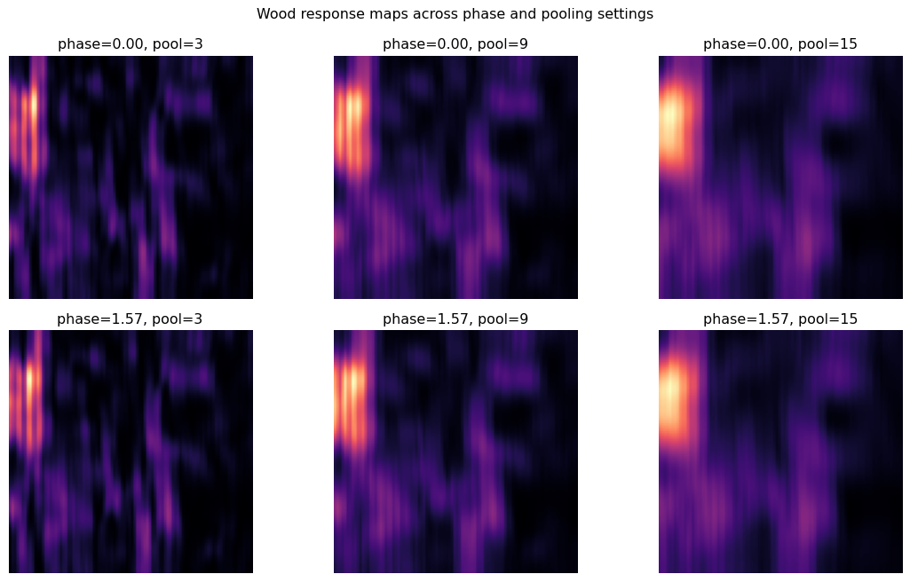

*Figure 1. Changing phase moves the response bands. Increasing the pooling size makes the map smoother and less sensitive to small shifts.*

## Edge Implementation

### Question 2

**Question.** Find a slanted or curved boundary where nearest-direction and interpolated NMS differ. Explain how the approximations change the result. Then show a case where 8-connectivity retains a weak diagonal chain that 4-connectivity rejects.

**Answer.** I used `bilinear_sample` inside `nms_interpolated` so that non-maximum suppression can compare a pixel with values at its actual gradient direction. On the slanted wood-grain boundaries in Notebook 1, interpolated NMS and nearest-direction NMS do not keep exactly the same pixels. Nearest-direction NMS rounds the direction to one of a few fixed choices. This can move a thin edge by a pixel or leave a slightly thicker edge. Interpolated NMS samples between pixels along the measured direction, so it follows a slanted boundary more closely.

`adaptive_thresholds` chooses the two hysteresis thresholds without using test labels. `hysteresis` then starts from strong edges and keeps connected weak edges. In the small diagonal example, the strong pixel is at `(0, 0)` and weak pixels are at `(1, 1)` and `(2, 2)`. With 8-connectivity, diagonal neighbours count as connected, so the whole chain remains. With 4-connectivity, diagonal neighbours do not count, so the weak pixels are removed.

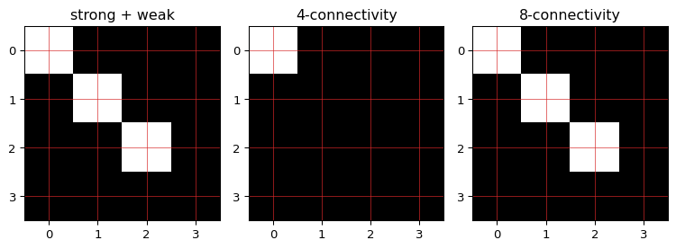

*Figure 2. The diagonal weak-pixel chain is retained with 8-connectivity but rejected with 4-connectivity.*

## Features and Representations

### Question 3

**Question.** Inspect the channel-scale plot in Notebook 1. Which feature families have the largest raw scale differences, and why is scaling required before fitting a linear classifier?

**Answer.** `extract_local_features` puts RGB colour, Gabor energy, gradient energy, edge density, and orientation-specific edge density on the same pixel grid. `global_pool` then turns each image into one descriptor using the required summary statistics. `feature_family_indices` groups the channels by feature family for the ablation study.

In the wood example, the RGB colour channels have much larger raw means than most Gabor and edge channels. The channels also have very different spreads: some are nearly constant across the image while others change a lot. A linear classifier uses numerical values directly. Without scaling, channels with larger numbers can have too much influence simply because of their units, not because they are more useful. `StandardScaler` gives the channels comparable scale before the logistic-regression classifier is fitted.

## Normality Model

**Question.** How is normal texture modelled without using defect labels during training?

**Answer.** For Task B, `fit_normal_model` learns the usual local feature values from normal training images only. `predict_anomaly` measures how unusual each pixel is compared with those normal values. `select_mask_threshold` chooses the mask threshold on validation data and freezes it before the test split is evaluated. This keeps the test labels separate from model and threshold selection.

## Results and Analysis Task A-C

### Task A - Material classification

**Question.** What were the material-classification results on the required split?

**Answer.** I trained on four normal images from each material, for 20 training images in total. The recorded validation and test sets each contain one good and one defective image from each of the five materials. On the required 10-image test subset, accuracy and macro-F1 were both **1.000**. The expected calibration error (ECE) was **0.0799**. Every material had two correct predictions, and both good and defective images had accuracy 1.000.

This is a very small test set, so it should not be read as proof that the classifier is perfect. The confidence plots in Figure 3 are included because the handout asks for them, but ten correct predictions are not enough to make a strong claim about calibration.

| Actual / predicted | carpet | grid | leather | tile | wood |
|---|---:|---:|---:|---:|---:|
| carpet | 2 | 0 | 0 | 0 | 0 |
| grid | 0 | 2 | 0 | 0 | 0 |
| leather | 0 | 0 | 2 | 0 | 0 |
| tile | 0 | 0 | 0 | 2 | 0 |
| wood | 0 | 0 | 0 | 0 | 2 |

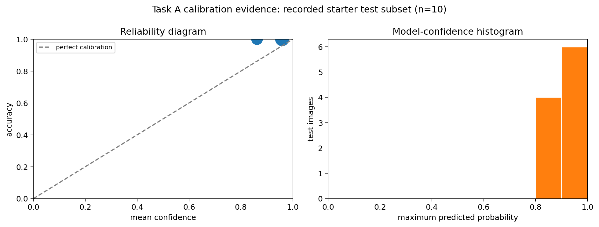

*Figure 3. Reliability diagram and confidence histogram for the recorded 10-image test subset. The dots show mean confidence and accuracy within each non-empty confidence bin.*

**Extra diagnostic, not part of the required score.** I added the following full-test check because the required 10-image test split is too small to show a useful confident error. The model was still trained on the same 20 starter training images. Across all 248 test images, its accuracy was 0.940. Accuracy was 0.938 for good images and 0.940 for defective images. This extra result is not used in place of the required 10-image result.

The two confident errors in Figure 4 were both grid images called carpet: `grid/test/good/005.png` at confidence 0.998 and `grid/test/glue/005.png` at confidence 0.997. In both cases, the repeated grid creates strong directional texture responses. Once the feature map is pooled into one image-level descriptor, the classifier no longer knows exactly where each response occurred. The local glue region is therefore easy to lose among the repeated grid pattern.

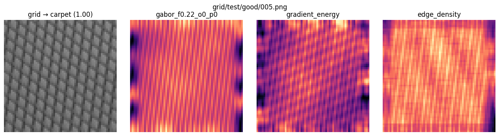

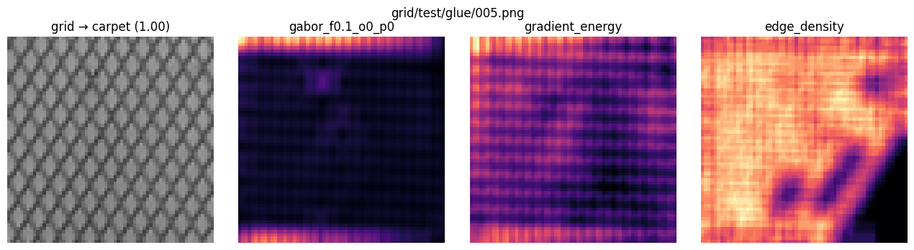

*Figure 4. Two supplementary full-test errors. Each row shows the source image, strongest Gabor response, gradient energy, and edge density.*

### Question 4

**Question.** Does the classifier become less accurate on defective images? Use visual evidence to explain one confident error rather than merely listing its predicted label.

**Answer.** No accuracy drop appeared in the required 10-image subset: both good and defective images were classified correctly. The extra full-test check tells the same story for this model, with 0.938 accuracy on good images and 0.940 on defective images. The grid/glue example in Figure 4 explains why a confident error can still happen. The classifier sees a strong repeated texture that resembles carpet after pooling, while the glue is a small local change. The high confidence is therefore not evidence that the prediction is sensible; it shows that the model is confident in the wrong pooled texture summary.

### Task B - Defect detection and localisation

**Question.** What were the defect-detection results, and which defects are better described by edges versus colour or broad texture changes?

**Answer.** Each of the 30 material-and-defect groups contributed two validation images and two test images, giving 60 images per split. Each material normal model used four normal training images. The combined feature model chose a pixel threshold of 6.1389 on validation data. On the test split, it reached pixel F1 **0.171**, IoU **0.094**, and image AUROC **0.702**. The Gabor-only model had threshold/AUROC 5.0715/0.746, and the edge-only model had threshold/AUROC 5.6374/0.680.

| Defect | Gabor IoU / F1 | Edge IoU / F1 | Combined IoU / F1 |
|---|---:|---:|---:|
| color | 0.158 / 0.272 | 0.260 / 0.412 | 0.205 / 0.340 |
| cut | 0.048 / 0.092 | 0.063 / 0.118 | 0.060 / 0.114 |
| hole | 0.130 / 0.229 | 0.107 / 0.194 | 0.116 / 0.208 |
| metal contamination | 0.000 / 0.000 | 0.000 / 0.000 | 0.000 / 0.000 |
| thread | 0.000 / 0.000 | 0.000 / 0.000 | 0.000 / 0.000 |
| bent | 0.000 / 0.000 | 0.000 / 0.000 | 0.000 / 0.000 |
| broken | 0.000 / 0.000 | 0.000 / 0.000 | 0.000 / 0.000 |
| glue | 0.138 / 0.242 | 0.201 / 0.335 | 0.197 / 0.329 |
| fold | 0.058 / 0.110 | 0.115 / 0.207 | 0.084 / 0.155 |
| poke | 0.013 / 0.025 | 0.029 / 0.056 | 0.022 / 0.043 |
| crack | 0.000 / 0.000 | 0.000 / 0.000 | 0.000 / 0.000 |
| glue strip | 0.000 / 0.000 | 0.000 / 0.000 | 0.000 / 0.000 |
| gray stroke | 0.000 / 0.000 | 0.000 / 0.000 | 0.000 / 0.000 |
| oil | 0.000 / 0.000 | 0.000 / 0.000 | 0.000 / 0.000 |
| rough | 0.000 / 0.000 | 0.000 / 0.000 | 0.000 / 0.000 |
| combined | 0.165 / 0.283 | 0.169 / 0.290 | 0.183 / 0.310 |
| liquid | 0.431 / 0.602 | 0.344 / 0.511 | 0.418 / 0.590 |
| scratch | 0.200 / 0.333 | 0.019 / 0.038 | 0.021 / 0.041 |

Cuts, holes, folds, cracks, and scratches can create narrow boundaries, so gradient and edge features may help if the boundary is still visible after the image is resized. Colour defects, liquid, oil, and other diffuse changes often alter colour or broad texture more than they create a clear boundary. RGB and Gabor features are more useful in those cases.

The result is not as neat as that rule suggests. The edge branch helped most for colour, glue, and fold in this small split. Gabor did better for liquid and scratch. Threads and cracks were not localised successfully. This is likely affected by image resizing, weak contrast, the fixed threshold, and the very small number of examples for each defect. Figure 5 shows a colour defect where the score map and mask are easier to interpret than many of the subtle defects.

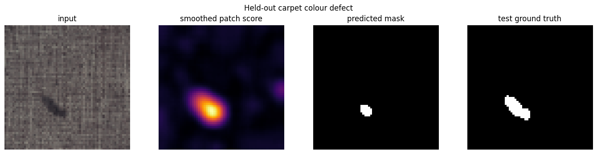

*Figure 5. A held-out carpet colour defect. The predicted mask is compared with the supplied test mask only for evaluation.*

### Question 5

**Question.** Identify one failure caused by image borders, registration, or illumination. How would the image score and mask change if the aggregation percentile or mask threshold were increased?

**Answer.** `tile/test/rough/003.png` shows a border-related failure. The model ignores a five-pixel border to avoid unreliable edge effects. After the image is resized to 64 x 64, 62 ground-truth defect pixels fall in that ignored border. Those pixels cannot be predicted as anomalous, even if their score is high.

If the image-score percentile is increased, the score depends more on only the strongest anomaly pixels. A small strong defect can then raise the image score more, but a broad weak defect may matter less. If the mask threshold is increased, the predicted mask becomes smaller. This can remove false-positive pixels, but it can also remove weak parts of a real defect.

### Task C - DTD attribute prediction

**Question.** What did the attribute model predict well, what did it struggle with, and what does the probability heatmap show?

**Answer.** I used three training images and two validation images for each of the 13 selected primary attributes. This gives 39 training images and 26 validation images. The macro AP was **0.253** and the macro F1 was **0.168**. These scores are unstable because the validation set is small, so I use them to identify patterns rather than to claim that the model is generally strong.

| Attribute | AP | F1 |
|---|---:|---:|
| banded | 0.667 | 0.667 |
| blotchy | 0.350 | 0.400 |
| braided | 0.063 | 0.000 |
| bumpy | 0.183 | 0.000 |
| cracked | 0.146 | 0.000 |
| fibrous | 0.078 | 0.000 |
| grid | 0.089 | 0.000 |
| marbled | 0.700 | 0.500 |
| pitted | 0.104 | 0.000 |
| porous | 0.065 | 0.000 |
| stained | 0.417 | 0.333 |
| striped | 0.134 | 0.000 |
| woven | 0.298 | 0.286 |

The best AP values were for `marbled` (0.700) and `banded` (0.667). In contrast, several visually detailed attributes, including `braided`, `fibrous`, `pitted`, and `porous`, had low AP and zero F1 at the fixed 0.5 threshold. The qualitative examples in Notebook 3 show the same issue: the model can sometimes identify a broad visual pattern, but it is much less reliable when the important detail is fine, irregular, or depends on its layout in the image.

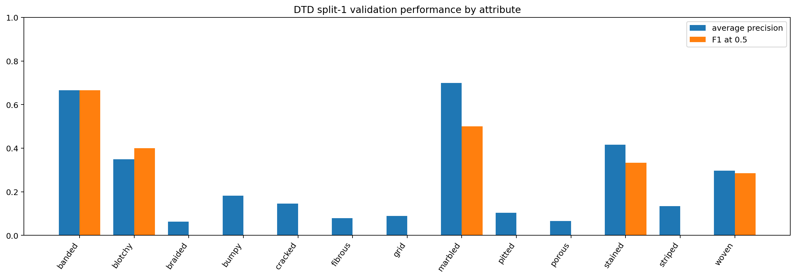

*Figure 6. AP and F1 for the selected DTD validation images.*

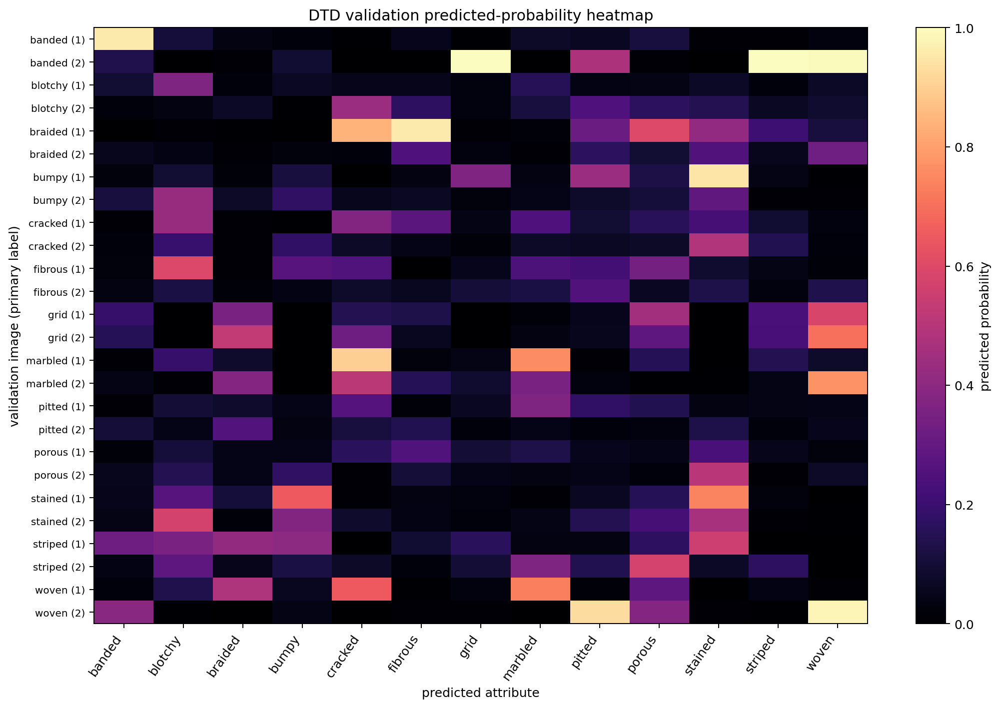

*Figure 7. Predicted probabilities for all 13 attributes on the 26 validation images. Rows are grouped by primary attribute. A row may have more than one valid attribute because DTD is multi-label.*

The heatmap is useful because it shows more than a single score. For example, a bright square away from the row's primary label is not automatically a mistake: the image may have that as a secondary DTD label. However, the heatmap also shows that many probabilities are spread over several related attributes instead of being clearly concentrated on one attribute. This matches the low macro F1.

| Cue in the image | Attributes where it may help | Features used | Main limitation |
|---|---|---|---|
| Repeated direction | banded, striped, grid, woven | directional Gabor energy and edge density | Pooling removes the exact layout and intersections of the pattern. |
| Fine or repeated texture | braided, bumpy, fibrous, pitted, porous, woven | Gabor energy at several scales and gradient energy | Resizing to 64 x 64 can remove fine fibres, pits, and braids. Different textures can also have similar overall frequency. |
| Colour or broad shading | blotchy, marbled, stained | RGB channels and low-frequency Gabor energy | Lighting can look like staining, and pooling removes the shape of a coloured region. |
| Thin or irregular boundaries | cracked, grid, striped | gradient energy, edge density, and directional Gabor energy | A crack may be too faint after resizing. A large number of edges does not by itself identify the kind of texture. |

### Question 6

**Question.** What information is present or absent in the handcrafted global descriptor?

**Answer.** The descriptor keeps several useful measurements: average colour, how much texture energy occurs at selected scales and directions, how strong the gradients are, and how dense the edges are. This is enough to capture simple evidence such as repeated bands, stripes, broad colour changes, or many edges.

What it loses is just as important. After global pooling, the descriptor does not know where a feature appeared, how different regions are arranged, or whether a small feature sits inside a larger pattern. It also has no high-level understanding of objects or material meaning. That is why a repeated grid can be confused with carpet, and why visually complex DTD attributes can be confused even when some of their local texture cues are present.

## Results and Analysis Task D

### Task D - Controlled defect-classification probe

**Question.** How well did the model work under the three Task D information conditions, and what can this small study tell us?

**Answer.** The saved responses detected a defect in all five D1 queries. D2 matched all five exact defect labels. D3 matched four of five; for Q2, the answer was `bent` rather than `broken`. All ten D2 and D3 answers used an allowed label.

| Condition | Result |
|---|---:|
| D1: defect detection | 5 / 5 |
| D2: exact defect label | 5 / 5 |
| D3: exact defect label | 4 / 5 |
| D2/D3: allowed-label compliance | 10 / 10 |

The final trials used model label `GPT - 5.6 Terra`, with `temperature = 0 & Reasoning = High`, on 2026-10-05. The exact prompts, attachment paths, predictions, and raw responses are stored in `student_files/task_d_predictions.csv`. The answer-key scores are summarised above.

This is a controlled qualitative check, not a comparison from which I can draw a broad conclusion. There are only five queries and all five are defective, so D1 specificity cannot be measured. A different run, a small change in prompt wording, or earlier exposure to similar MVTec examples could change the results. The one D3 error also shows that examples do not guarantee that two related defect labels will be separated correctly.

## Results and Analysis Custom Photos

### Personal photos and Texture Passports

**Question.** What happened when the frozen models were applied to the personal photographs, and what limits the conclusions?

**Answer.** I collected 15 photographs: five carpet, five wood, and five tile. The manifest records the annotations made before prediction and EXIF removal. I varied viewpoint, distance, and lighting across the set. The removable anomalies include a loose light thread on carpet, small yellow pieces on wood, and a white scrap on tile.

Annotator 1 was me. Annotator 2 was AI because this is an individual submission and I did not have a second human annotator. The mean Jaccard overlap was 0.784, so this is human-AI agreement, not agreement between two people.

The frozen material classifier was correct for 4 of 15 personal photos: 0 of 5 carpet photos, 1 of 5 wood photos, and 3 of 5 tile photos. This is much weaker than its performance on the MVTec test images. The phone photos differ from the training data in lighting, viewpoint, scale, and background context. A confident prediction on these photos should therefore not be treated as reliable.

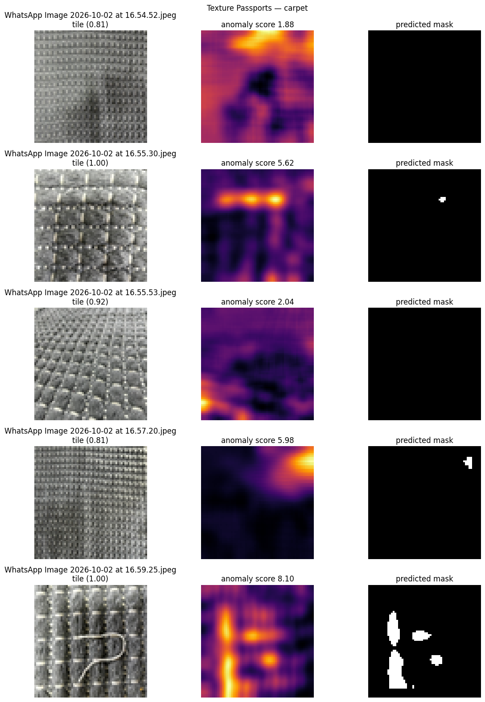

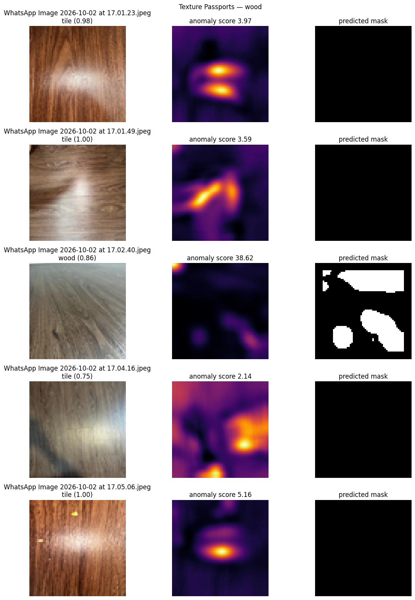

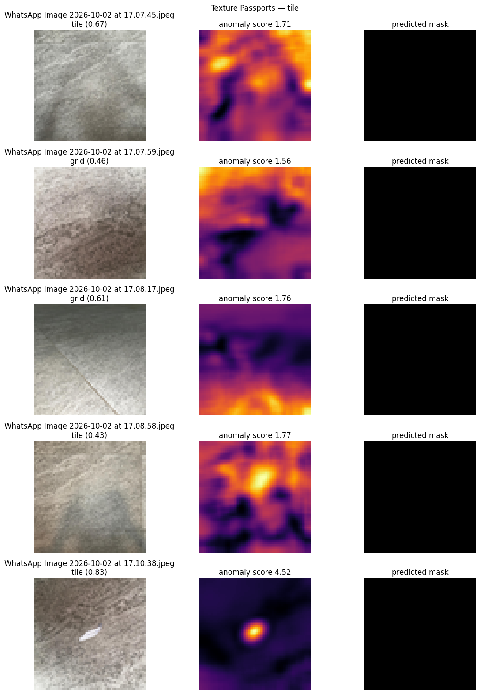

*Figure 8. Texture Passports grouped by material. Each passport includes the source photo, anomaly heatmap, and predicted mask.*

| Photo | Predicted material (confidence) | Top five DTD attributes (score) | Anomaly score | Visible evidence |
|---|---|---|---:|---|
| 16.54.52 | tile (0.81) | fibrous .62; stained .53; blotchy .20; porous .11; marbled .10 | 1.884 | Raised carpet weave under even, straight-on lighting. |
| 16.55.30 | tile (1.00) | stained .29; fibrous .20; porous .13; cracked .12; pitted .10 | 5.620 | Close view of thick yarn rows and pale cross-stitches. |
| 16.55.53 | tile (0.92) | stained .21; fibrous .21; grid .20; marbled .10; striped .08 | 2.041 | Oblique view of raised carpet tufts. |
| 16.57.20 | tile (0.81) | porous .56; fibrous .50; stained .36; striped .25; blotchy .17 | 5.976 | Carpet rows are side-lit, with shading across the surface. |
| 16.59.25 | tile (1.00) | braided .58; porous .43; cracked .15; striped .12; fibrous .09 | 8.096 | A loose light thread crosses the close-up carpet weave. |
| 17.01.23 | tile (0.98) | stained .66; blotchy .56; bumpy .25; banded .20; porous .12 | 3.970 | Wood grain is visible beneath a bright flash reflection. |
| 17.01.49 | tile (1.00) | stained .76; blotchy .68; bumpy .37; banded .23; braided .09 | 3.593 | Wider wood view with a central reflection and long grain. |
| 17.02.40 | wood (0.86) | fibrous .28; blotchy .27; stained .17; braided .16; marbled .16 | 38.618 | Oblique wood view with converging grain and a dark knot-like region. |
| 17.04.16 | tile (0.75) | stained .84; blotchy .31; bumpy .23; fibrous .18; banded .10 | 2.143 | Wood grain and a plank seam under uneven light. |
| 17.05.06 | tile (1.00) | blotchy .50; stained .35; banded .18; cracked .18; porous .16 | 5.163 | Small yellow pieces sit on the close-up wood surface. |
| 17.07.45 | tile (0.67) | stained .53; pitted .33; blotchy .21; woven .12; grid .12 | 1.715 | Close surface view of cloudy tile veining. |
| 17.07.59 | grid (0.46) | stained .88; bumpy .21; fibrous .17; grid .17; pitted .14 | 1.561 | Tile shows broad diagonal veining and a visible seam. |
| 17.08.17 | grid (0.61) | stained .95; fibrous .56; cracked .12; bumpy .10; woven .10 | 1.758 | Oblique tile view with diagonal veins and a grout line. |
| 17.08.58 | tile (0.43) | stained .49; pitted .40; cracked .18; woven .17; blotchy .12 | 1.774 | Uneven lighting crosses the mottled tile and grout line. |
| 17.10.38 | tile (0.83) | stained .68; bumpy .32; blotchy .22; grid .15; pitted .12 | 4.523 | A white scrap lies on the tile; the mask is a model response, not ground truth. |

**Extra presentation choice.** The handout requires an uncertainty or limitation statement for every Texture Passport, but it does not require a separate table. I added the table below so that the limitation for each of the 15 photos is easy to find and check.

| Photo | Uncertainty or limitation |
|---|---|
| 16.54.52 | The wide view may weaken fine carpet-weave cues; the material prediction is tile (0.81). |
| 16.55.30 | The close crop removes wider carpet context, which may contribute to the confident tile prediction (1.00). |
| 16.55.53 | The oblique view changes the apparent direction and scale of the carpet tufts; the model predicts tile (0.92). |
| 16.57.20 | Side-lighting adds strong shadows across the carpet rows, affecting both texture features and anomaly scores. |
| 16.59.25 | The loose thread is small compared with the surrounding weave, so the response mask may include nearby yarn or miss thread pixels. |
| 17.01.23 | Flash reflection may hide the wood grain and contribute to the tile prediction (0.98). |
| 17.01.49 | Flash glare may dominate the pooled features; the model predicts tile (1.00). |
| 17.02.40 | The oblique view and dark knot-like region may explain the high anomaly score (38.618). There is no personal-photo ground-truth mask to separate natural wood variation from an anomaly. |
| 17.04.16 | Uneven lighting and the plank seam may raise local anomaly responses; the model predicts tile (0.75). |
| 17.05.06 | Flash and staged crumbs both affect the close-up, so the high anomaly response cannot be assigned to the crumbs alone; the model predicts tile (1.00). |
| 17.07.45 | The cloudy veining and high `stained` score may describe the tile's normal pattern rather than a defect. |
| 17.07.59 | The close-up removes broader surface context; the predicted grid label has low confidence (0.46). |
| 17.08.17 | The oblique view changes the apparent direction of veins and grout; the model predicts grid (0.61). |
| 17.08.58 | Uneven illumination may be confused with surface staining; the tile prediction has low confidence (0.43). |
| 17.10.38 | The white paper strip creates strong local contrast; the anomaly mask is a model response, not a ground-truth defect boundary. |

These limitations are based on the capture conditions and what is visible in the photos. They are not ground-truth diagnoses.

## Function and evidence traceability

| Function | Where it is explained in this report | Evidence used |
|---|---|---|
| `make_gabor_bank` | Question 1 | Notebook 1 filter bank and Figure 1 |
| `gabor_energy_maps` | Question 1 | Notebook 1 response maps and Figure 1 |
| `bilinear_sample` | Question 2 | Notebook 1 slanted-boundary comparison |
| `nms_interpolated` | Question 2 | Notebook 1 signed NMS difference plot |
| `adaptive_thresholds` | Question 2 and Task B | Notebook 1 threshold output; Notebook 2 validation threshold selection |
| `hysteresis` | Question 2 | Notebook 1 four- versus eight-connectivity example and Figure 2 |
| `detect_edges` | Question 2 and Task B | Notebook 1 edge pipeline; Notebook 2 edge-only ablation |
| `extract_local_features` | Question 3 | Notebook 1 aligned feature maps and channel-scale plot |
| `global_pool` | Questions 3, 4, and 6 | Notebook 2 material classifier and Figure 4 error analysis |
| `feature_family_indices` | Question 3 and Task B | Notebook 2 Gabor-only, edge-only, and combined ablation |
| `fit_normal_model` | Normality Model and Task B | Notebook 2 normal models fitted from normal training images |
| `predict_anomaly` | Normality Model, Task B, and personal photos | Notebook 2 score maps and Figure 5; Figure 8 passports |
| `select_mask_threshold` | Normality Model, Task B, and Question 5 | Notebook 2 validation-to-test threshold procedure |

## AI-use disclosure table

| Tool or source | Affected artefacts | Markers | Contribution | Verification |
|---|---|---|---|---|
| `GPT - 5.6 Terra` | `student_files/task_d_predictions.csv`; Task D discussion | [AI-VISION] [AI-LANGUAGE] | Produced the saved D1-D3 responses, confidence values, visible-evidence descriptions, and raw responses. | The trials were rerun and recorded. The saved predictions were compared with `solution/task_d_answer_key.csv` to produce the reported scores. |
| ChatGPT / Codex | `texturelab/`; Notebooks 1-4; figures and explanations in this report | [AI-CODE] [AI-DESIGN] [AI-LANGUAGE] | Assisted with implementation, notebook additions, figure generation, and report wording. | The notebooks were run on the recorded splits, the report figures were checked, and all 23 unit tests passed. |
| ChatGPT / Codex | `manifests/personal_annotations.csv` | [AI-VISION] | Provided the second set of DTD-term selections for the personal photos. | The first annotation set was made by the student before inference. The reported 0.784 overlap is clearly described as human-AI agreement. |
| Student | Personal photographs, first annotation set, experiment choices, and final review | [HUMAN-DATA] [HUMAN-CHECK] | Collected the photos, chose the recorded splits and settings, checked the outputs, and reviewed the final report. | The student inspected the images and results; recorded metrics, figures, raw Task D responses, and unit tests provide the supporting evidence. |
